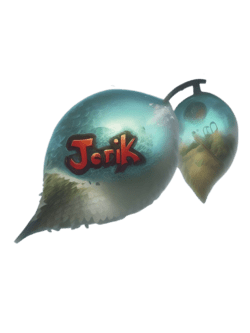

<p align="center">

</p>


[](https://github.com/T-R-I-X/Jorik-TS/actions/workflows/build.yml)

*A opensource RobloxMMORPG game written in Typescript for strict type checking.*

## Features (Planned)
- ❌ combat (skills, basic moves, animations)
- ❌ npcs (pathfinding, random movement, questing, random events)
- ❌ Social features (interacting, viewing, chatting, etc.)
- ❌ Mounts
- ❌ Player housing
- ❌ PVE combat
- ❌ PVP combat
- ❌ Player owned shops, NPC owned shops
- ❌ Full user game interface (GUI)
- ✅ Datasaving


## For developers
Here are the links to some resources

[Roblox-TS](https://roblox-ts.com)\
[Flamework](https://fireboltofdeath.dev/docs/flamework)\
[@rbxts/suphi-datastore](https://www.npmjs.com/package/@rbxts/suphi-datastore)

## Get started
1. Clone or download this repo
```
git clone https://github.com/T-R-I-X/Jorik-TS
cd Jorik-TS
```
2. Install the dependencies
```
npm install
```
3. Install Rojo\
Refer to the [docs](https://rojo.space/docs/v7/getting-started/installation/)
4. Build the game
```
npm run build
```
5. Serve
```
rojo serve
```

[Contributors](https://github.com/T-R-I-X/Jorik-TS/graphs/contributors)